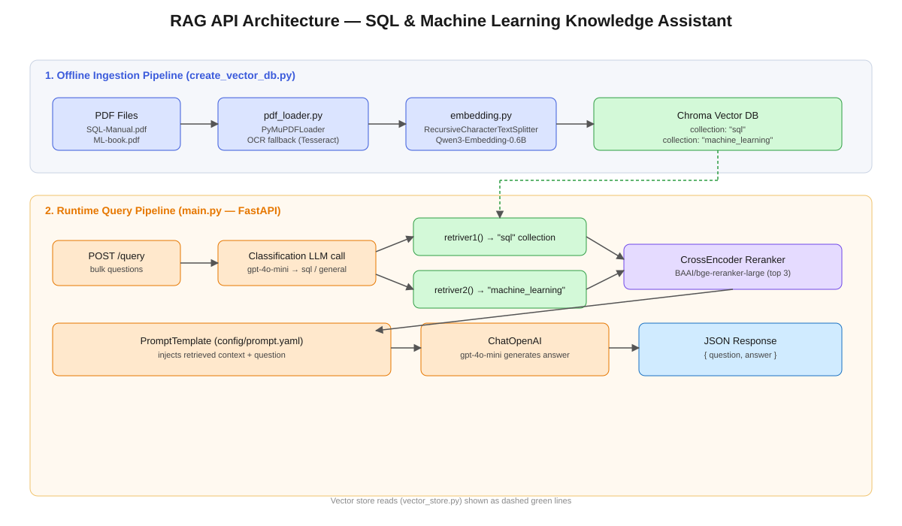

# 🔎 Multi-Domain RAG API — SQL & Machine Learning Knowledge Assistant

A production-style **Retrieval-Augmented Generation (RAG)** backend built with **LangChain**, **Chroma**, **FastAPI**, and **OpenAI**. The system ingests domain-specific PDFs (an SQL manual and a Machine Learning book), stores them as vector embeddings, and answers user questions by first **classifying the question's domain**, then retrieving + reranking the most relevant chunks before generating a grounded answer.



---

## 📌 Table of Contents

- [Overview](#-overview)
- [Features](#-features)
- [Tech Stack](#-tech-stack)
- [Project Structure](#-project-structure)
- [How It Works](#-how-it-works)
- [Prerequisites](#-prerequisites)
- [Installation](#-installation)
- [Configuration](#-configuration)
- [Usage](#-usage)
- [API Reference](#-api-reference)
- [Known Limitations & Improvement Ideas](#-known-limitations--improvement-ideas)
- [Roadmap](#-roadmap)
- [License](#-license)

---

## 🧭 Overview

This project demonstrates an end-to-end multi-collection RAG pipeline:

1. **Ingest** PDFs → extract text (with OCR fallback for scanned pages) → chunk → embed → store in **Chroma**.
2. **Serve** a FastAPI endpoint that accepts one or more questions, **classifies** each into a domain (`sql` or `general`), retrieves context from the matching Chroma collection, **reranks** results with a cross-encoder, and generates a final answer with **GPT-4o-mini**.

It's designed as a reference implementation for building **domain-routed RAG systems** rather than a single flat knowledge base.

## ✨ Features

- 📄 **Robust PDF ingestion** — text-layer extraction via `PyMuPDFLoader`, with automatic OCR fallback (`pytesseract` + `pdf2image`) for scanned/image-based PDFs.
- ✂️ **Recursive chunking** — `RecursiveCharacterTextSplitter` (1500 chars, 150 overlap).
- 🧠 **Open-source embeddings** — `Qwen/Qwen3-Embedding-0.6B` via `langchain_huggingface`.
- 🗂️ **Multi-collection vector store** — separate Chroma collections per knowledge domain (`sql`, `machine_learning`).
- 🎯 **Query classification** — an LLM call routes each question to the correct retriever before searching.
- 📊 **Two-stage retrieval** — similarity search (top-7) followed by cross-encoder reranking (`BAAI/bge-reranker-large`) down to the top-3 most relevant chunks.
- ⚡ **Async, bulk-capable API** — FastAPI endpoint accepts a batch of questions and processes them concurrently with `asyncio.gather`.
- 🧩 **Prompt management via YAML** — system and classification prompts are externalized to `config/prompt.yaml`.

## 🛠️ Tech Stack

| Layer | Technology |
|---|---|
| API Framework | FastAPI |
| LLM | OpenAI `gpt-4o-mini` (via `langchain_openai`) |
| Orchestration | LangChain |
| Embeddings | HuggingFace `Qwen3-Embedding-0.6B` |
| Vector Store | Chroma (`langchain_chroma`) |
| Reranker | `sentence-transformers` CrossEncoder (`BAAI/bge-reranker-large`) |
| PDF Parsing | PyMuPDF (`PyMuPDFLoader`) |
| OCR Fallback | Tesseract OCR + `pdf2image`/Poppler |
| Config | YAML, `python-dotenv` |

## 📁 Project Structure

```
.
├── main.py                  # FastAPI app, /query endpoint, classification + generation
├── src/
│   ├── retriver.py          # Retrieval + reranking logic (imported as src.retriver in main.py)
│   └── vector_store.py      # Chroma vector store instances (imported as src.vector_store)
├── embedding.py              # Embedding model + text chunking
├── pdf_loader.py              # PDF text extraction with OCR fallback
├── create_vector_db.py        # One-off script to build/persist the Chroma vector DB
├── config/
│   └── prompt.yaml            # system_prompt + classification_prompt templates
├── .env                        # HF_TOKEN, OPENAI_API_KEY (not committed)
├── requirements.txt
└── README.md
```

> ⚠️ **Note:** `main.py` imports `from src.retriver import retriver1, retriver2` and `retriver.py` imports `from src.vector_store import ...`, which implies `retriver.py` and `vector_store.py` belong inside a `src/` package. Place them there (with an `__init__.py` if needed) or update the imports to match your actual layout — see [Known Limitations](#-known-limitations--improvement-ideas).

## ⚙️ How It Works

**Ingestion (`create_vector_db.py`, run once/offline):**

`PDF → pdf_loader.extract_text_from_pdf() → embedding.text_to_chunk() → Chroma.from_documents()`

**Query time (`main.py`, run as a live API):**

1. Client sends a batch of questions to `POST /query`.
2. Each question is classified (`sql` vs `general`) by an LLM call using `classification_prompt`.
3. The matching retriever (`retriver1` for SQL, `retriver2` for general/ML) pulls the top 7 similar chunks from Chroma, then reranks them with the cross-encoder and keeps the top 3.
4. Retrieved context + question are formatted into `system_prompt` and sent to `gpt-4o-mini`.
5. The API returns `{ question, answer }` for every item, all processed concurrently.

## ✅ Prerequisites

- Python 3.10+
- An OpenAI API key
- A HuggingFace token (for downloading the embedding model)
- [Tesseract OCR](https://github.com/tesseract-ocr/tesseract) installed locally
- [Poppler](https://github.com/oschwartz10612/poppler-windows) installed locally (for `pdf2image`)

## 🚀 Installation

```bash
# 1. Clone the repository
git clone https://github.com/<your-username>/<your-repo-name>.git
cd <your-repo-name>

# 2. Create and activate a virtual environment
python -m venv venv
venv\Scripts\activate        # Windows
source venv/bin/activate     # macOS/Linux

# 3. Install dependencies
pip install -r requirements.txt
```

**`requirements.txt`** should include (pin versions as needed):

```
fastapi
uvicorn
langchain
langchain-openai
langchain-huggingface
langchain-chroma
langchain-community
langchain-text-splitters
sentence-transformers
pdf2image
pytesseract
pymupdf
python-dotenv
pyyaml
pydantic
```

## 🔐 Configuration

Create a `.env` file in the project root:

```env
OPENAI_API_KEY=sk-your-openai-key
HF_TOKEN=hf_your-huggingface-token
```

Create `config/prompt.yaml`:

```yaml
system_prompt: |
  You are a helpful assistant. Answer the question using only the
  provided context. If the answer isn't in the context, say you don't know.

  Context:
  {context}

  Question:
  {question}

classification_prompt: |
  Classify the following question into exactly one category: "sql" or "general".
  Respond with only the category name in lowercase.

  Question:
  {question}
```

> Also update the hard-coded Windows paths (`D:/Niraj/rag/...`, Tesseract, Poppler) in `create_vector_db.py`, `pdf_loader.py`, and `vector_store.py` to match your machine, or better, load them from environment variables.

## ▶️ Usage

**1. Build the vector database (run once, or whenever source PDFs change):**

```bash
python create_vector_db.py
```

**2. Start the API server:**

```bash
uvicorn main:app --reload
```

**3. Query it:**

```bash
curl -X POST http://127.0.0.1:8000/query \
  -H "Content-Type: application/json" \
  -d '{
        "bulkrequest": [
          { "question": "How do I write an INNER JOIN in SQL?" },
          { "question": "What is the difference between bagging and boosting?" }
        ]
      }'
```

**Example response:**

```json
{
  "results": [
    { "question": "How do I write an INNER JOIN in SQL?", "answer": "..." },
    { "question": "What is the difference between bagging and boosting?", "answer": "..." }
  ]
}
```

## 📡 API Reference

### `POST /query`

Accepts a batch of questions and returns generated answers.

**Request body**

| Field | Type | Description |
|---|---|---|
| `bulkrequest` | `list[{ question: str }]` | One or more questions to answer |

**Response body**

| Field | Type | Description |
|---|---|---|
| `results` | `list[{ question, answer }]` | Answer (or `error` if classification failed) per question |

## ⚠️ Known Limitations & Improvement Ideas

A few things worth fixing before treating this as production-ready — useful to flag in the README so contributors know what's next:

- **`await` on sync calls** — `retriver.invoke(query)` (LangChain retrievers) and `reranker.predict(pairs)` (sentence-transformers `CrossEncoder`) are synchronous methods; awaiting them directly will raise a `TypeError`. Use `retriver.ainvoke(query)` for the retriever, and wrap `reranker.predict` in `asyncio.to_thread(...)` (or run it sync) for the cross-encoder.
- **Import path mismatch** — `main.py` and `retriver.py` reference a `src/` package (`from src.retriver import ...`, `from src.vector_store import ...`) that doesn't exist in the flat file structure shown here. Either move `retriver.py`/`vector_store.py` into `src/` or update the imports.
- **Hard-coded local paths** — Windows-specific paths for the vector DB, Tesseract, and Poppler should move to environment variables or a config file for portability.
- **Model loaded at import time** — the `CrossEncoder` reranker loads on module import in `retriver.py`, which slows every process start; consider lazy-loading or caching it.
- **No error handling around external calls** — OpenAI/HuggingFace API failures, empty retrieval results, and malformed PDFs aren't explicitly handled.
- **Secrets** — ensure `.env` is in `.gitignore` before pushing to GitHub.

## 🗺️ Roadmap

- [ ] Add automated tests (ingestion, retrieval, API)
- [ ] Add Docker support for reproducible deployment
- [ ] Add streaming responses for the `/query` endpoint
- [ ] Add evaluation (e.g. RAGAS) to measure retrieval/answer quality
- [ ] Add authentication for the API

## 📄 License

Add a license of your choice (MIT is a common default for portfolio projects) — create a `LICENSE` file at the repo root.

---

<p align="center">Built as a domain-routed RAG reference implementation — PRs and issues welcome.</p>
